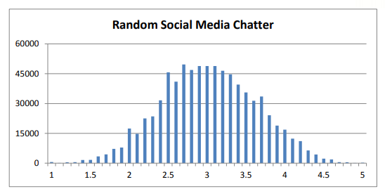
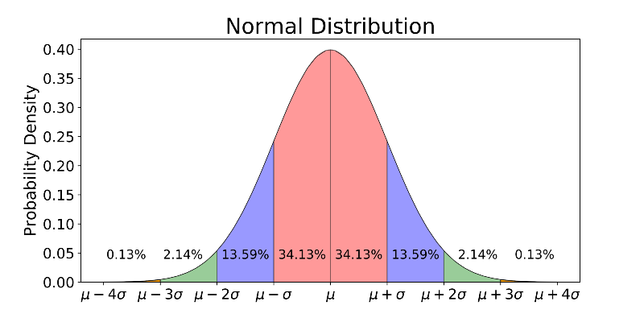
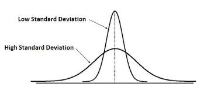
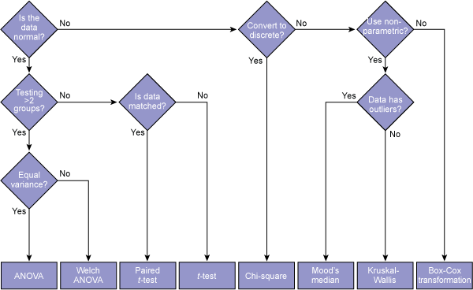

```{r setup, include=FALSE}
knitr::opts_chunk$set(echo = TRUE)
```

## Learning to Code

https://github.com/freeCodeCamp/2016-new-coder-survey#about-the-data

This is a survey of over 15,000 respondants about their experiences of learning to code. You can read more about their goals, process, and survey [here](https://www.freecodecamp.org/news/we-just-launched-the-biggest-ever-survey-of-people-learning-to-code-cac81dadf1ea/#.8g9ts8gm5). The "Learn to Code!" buzz is not the same everywhere in the world, but it is clear that there is a need for these skills across almost every domain. But who is trying to learn? And who is failing? How might we intervene? You are a learner too, and it will be fun to compare your own answers to the survey as we go along. Today's lesson will be a warmup in R, Statistics, and handling data. 

## Topics Covered:

- data types
- data structure
- factors and outcomes
- measures of centrality
- bar plots
- normal distribution
- wilcox test
- kruskall wallis


## Load Your Libraries
```{r message=FALSE,warning=FALSE}
library(ggplot2)
library(dplyr)
library(kableExtra)

```

## Data Structure
```{r }
data <- read.csv("../data/newcoders.csv")
#head(data)

# how many people are in this dataset?
nrow(data)

# how many columns/questions?
ncol(data)

#this dataset is almost 50% NAs. It's not a problem, but something to be aware of
sum(!is.na(data))/sum(is.na(data))
```

## Useful Things To Do With Variables

```{r}

#get the data type
typeof(data$Age)

#get some descriptive statistics on the column
summary(data$Age)

#get the structure: datatype, range, and head
str(data$Age)

```

## Measures of Centrality
Mean, median, and mode
```{r message=FALSE, warning=FALSE}
#R doesn't have a built-in mode, but this means find the highest count for any of the values and return that value
getmode <- function(v) {
   uniqv <- unique(na.omit(v))
   uniqv[which.max(tabulate(match(v, uniqv)))]
}

#mean, median, and mode

mean_age <-mean(data$Age,na.rm=TRUE)
med_age <- median(data$Age,na.rm=TRUE)
mode_age <-getmode(data$Age)

ggplot(data,aes(Age))+
  geom_histogram()+
  geom_vline(xintercept = mean_age,linetype="dashed",color="red")+
  geom_vline(xintercept = med_age,linetype="dashed",color="blue")+
  geom_vline(xintercept = mode_age,linetype="dashed",color="green")+
  theme_bw()


```

## Factors and Outcomes We Care About
When developing a research question, we often start with a vague idea of what you'd like to know about.

> "I want to know about people who learn to code in coding bootcamps"

The next steps involve questioning every inch of this idea until you have a fully formed, answerable research investigation. *What do you want to know? Any bootcamps? What people? What are they learning? Where? Do you want to know about their experience during or after?* There is **so much** to know, and this process can quickly become overwhelming. I remember during the first quarter of my PhD being so frustrated every time someone would poke at my barely formed research question, saying "yeah but what is *learning* exactly?"  This lesson will put into practice some of this "narrowing down" necessary to make progress. We might have a large dataset, with 15000 respondents and over 100 questions, but we will systematically choose our focus to make sense of a research question.By the end of the lesson, you may want to investigate something else in this dataset, and you'll have the tools to do that.

### Outcomes
Let's begin with identifying the **outcomes** we want to know about. These may also be referred to as **response variables** or **dependent variables**. They may also simply be represented by the variable **y**. So, we have a dataset of people who went through coding bootcamps. Maybe we want to know about their success in the bootcamp (whether they finished or not), their job prospects, and their income. We are also interested in their Employment field, which was answered categorically. 

Here we can see the summaries of the relevant outcome variables. Note that both `BootcampPostSalary` and `Income` (in the past year) were recorded. I'm assuming that these are different because maybe some people got salary boosts for participating in bootcamps, were offerred short contracting jobs, or other factors that made it so that it does not match up with the current Incomes at the time of the survey. More people answered about their Income, so we will use that measure primarily.

```{r}
summary(data$BootcampFinish)

summary(data$BootcampFullJobAfter)


summary(data$BootcampPostSalary)

summary(data$Income)

kable(summary(data$EmploymentField))%>%
  kable_styling(bootstrap_options = c("striped", "hover"))
```

### Factors
The **factors** are variables that may be affecting the outcomes we care about. These may also be referred to as **independent variables** or represented by the variable **x** (sometimes with numbered subscripts when there are multiple independent variables involved). Often these are demographics variables or things like time. Here, I select a few interesting factors: *Age, Gender, Money invested in the bootcamps, Education (including school major), Software development experience, and time spent practicing.*

```{r}
summary(data$Age)


summary(data$Gender)

summary(data$MoneyForLearning)

summary(data$MonthsProgramming)
summary(data$HoursLearning)

kable(summary(data$SchoolDegree))%>%
  kable_styling(bootstrap_options = c("striped", "hover"))

majors <- data[!is.na(data$SchoolMajor),] %>%
  count(SchoolMajor)%>%
  arrange(desc(n)) 
kable(head(majors,10))%>%
  kable_styling(bootstrap_options = c("striped", "hover"))

```
## Descriptive vs. Inferential Statistics

A good place to start is working with the difference between descriptive and inferential statistics. **Descriptive** statistics are summmarizing and describing the data, without making conclusions about the larger population. This includes things like **measures of centrality, ranges, counts, spreads** and more. **Inferential** statistics uses the sample data to make conclusions about hypotheses regarding the general population that the sample may have come from. This includes **hypothesis testing** and **modeling**. Inferential statistics is also where you would see things like **effect size** and **significance (or p) values**. The way that I think about hypothesis testing is that we are looking for evidence for whether or not there is a *true difference* between groups. A *true difference* would mean a difference in the means or distributions that could reliably generalize if we got more people in the sample. We can never *prove* anything with statistics, but we can collect evidence. And that is powerful.

### Descriptive
We started looking at descriptive statistics when we used the `summary()` command in R. Another tool for descriptive statistics is data visualization and **histograms**. Below, we have a histogram for one of our outcome variables, `Income`
```{r fig.width=10, warning=FALSE}
ggplot(data,aes(Income))+
  geom_histogram(bins=40)+
  theme_bw()


```

Let's refer to one of our **factors** and take a look at a visualization of `Income`. I've selected `SchoolDegree` to see if the type of degree you have interacts with income in any way. What do you think?

```{r fig.width=10}
levels(data$SchoolDegree)

ggplot(data[!is.na(data$SchoolDegree),],aes(Income,fill=SchoolDegree))+
  geom_histogram(position="dodge")+
  theme_bw()

```

The above graph is a bit difficult to interpret. Instead, let's look at a more isolated comparison.  Let's isolate the groups we are curious about using `dplyr` and the `filter()` command in order to get a clearer visualization of those groups.

```{r fig.width=10}
ba_and_ma <- data %>%
                  filter(SchoolDegree %in% c("bachelor's degree", "master's degree (non-professional)","trade, technical, or vocational training"))


ggplot(ba_and_ma,aes(Income,fill=SchoolDegree))+
  geom_histogram(position="dodge")+
  theme_bw()

```
At first, it's tempting to say that the groups differ by a lot, just by looking at the histogram. But this observation is almost entirely due to the fact that *much more* responders had Bachelor's degrees than any of the other `SchoolDegree` values. The histogram is showing raw counts, meaning that it's going to look very skewed towards the group with the largest population. We can barely even see the trade schoolers.

Let's take a look at a **normalized** histogram, and discuss what that means. Take a peek at the ballers over in the $200,000 income range. From the above histogram, we see that the raw count for those in that range is higher for those with Bachelor's degrees, and lowest for those with trade school experience.

```{r}
ba_and_ma$SchoolDegree <- droplevels(ba_and_ma$SchoolDegree)
kable(table(ba_and_ma$SchoolDegree[ba_and_ma$Income==200000]))%>%
  kable_styling(bootstrap_options = c("striped", "hover"))

```
When we look at the *proportions*, maybe we have a different story. Is `.0085` (Bachelor's) really different from `.0083` (Master's)? Is `.0067` (trade school) really different? Or could it be the case that no matter what degree you started with, the coding bootcamps give you an equal opportunity for eventual Income?

The numbers confirm what we observed in the raw counts. The raw counts are not useless as we may want to know that more bootcampers had Bachelor's degrees and most of those in the $200,000 Income range had Bachelor's degrees (in this subset). But in comparing the *distributions*, we need the **proportions** instead.

```{r}

ggplot(ba_and_ma[ba_and_ma$SchoolDegree=="bachelor's degree",],aes(Income))+
         geom_histogram(bins=100)+
  theme_bw()

ggplot(ba_and_ma[ba_and_ma$SchoolDegree=="master's degree (non-professional)",],aes(Income))+
         geom_histogram(bins=40)+
  theme_bw()

ggplot(ba_and_ma[ba_and_ma$SchoolDegree=="trade, technical, or vocational training",],aes(Income))+
         geom_histogram(bins=40)+
  theme_bw()

ba_and_ma <- ba_and_ma %>%
  group_by(SchoolDegree,Income) %>%
  summarise(n=n())%>%
  mutate(prop = n / sum(n))

#48/sum(ba_and_ma$n[ba_and_ma$SchoolDegree=="bachelor's degree"])


kable(na.omit(ba_and_ma[ba_and_ma$Income==200000,]))%>%
  kable_styling(bootstrap_options = c("striped", "hover"))


```

```{r fig.width=10, warning=FALSE}
plt=ggplot(ba_and_ma,aes(Income,prop,color=SchoolDegree))+
            facet_wrap(~SchoolDegree)+
             geom_point(stat="identity")+
             theme_bw()+
              ylim(0,.04)
plt

plt=ggplot(ba_and_ma,aes(Income,prop,color=SchoolDegree))+
             geom_point(stat="identity")+
             theme_bw()+
              ylim(0,.04)
plt

#i've been wrestling way too long with trying to get this to show up like a bar chart and I give up for now


```

We might be able to use our common sense to determine that these two groups are, in fact, the same. But it is not always so clear. This is why we rely on statistical tests to *find evidence against the null hypothesis*. The **null hypothesis** can be thought of like the "devil's advocate" of the problem: Nothing is happening here, there is no difference, and you're wasting your time looking for one. With enough evidence, we can argue that the null hypothesis is full of BS. We can never *prove* the alternative hypothesis, but we can show that the null hypothesis is very unlikely. Keep in mind, this might be a good thing or a bad thing; it depends what you are investigating and trying to show. In this example, it might be very interesting that `SchoolDegree` is *not* affecting `Income` if you enroll in a coding bootcamp. That would be good news for many people trying to make it in the tech world. That is where interpretation of results comes into play, where you need to think about if what kind of impact your results could have on people's lives. But the statistics themselves are not making a good or bad judgement; they are simply demonstrating what the evidence shows.

### Inferential
Using our example from above, Bachelor's vs. Master's degree students and their `Income` values, let's look to see if we can find evidence that they are truly different phenomena. I've also included the trade schoolers, but we will get to that later.


> Null Hypothesis (H<sub>0</sub>): There is no true difference in Income for those with Bachelor's degrees vs those with Master's degrees.
>
> Alternative Hypothesis (H<sub>A</sub>): There is a true difference in Income for those with Bachelor's degree vs those with Master's degrees.

We will use inferential statistics to provide evidence for or against the null hypothesis.


## Normality

But first, we need to talk about normality.

<center>  </center>

You may have heard of the **normal distribution**, or heard it referred to as a **bell curve**, **normal curve**, or perhaps even a **Gaussian curve**. Note, it gets referred to as a Gaussian because it was discovered by a guy named Gauss. It took me a while to realize that the people around me were referring to a simple bell curve when all I was hearing was the word "Gaussian", which is just a fancier and less-descriptive way to say normal distribution. 

The reason we need to talk about normality is two-fold:

- thinking of phenomena in terms of **standard deviation**, **means**, and **number of standard deviations from the mean** can be helpful to learn about probability and inferential statistics
- we need to test our variables for normality in order to know if we should use **parametric** or **nonparametric** methods

### The Normal Distribution

Many real-life variables follow a normal distribution. That means that the large majority (68%) tend to fall towards a mean (or average) value, and less values fall further from that mean. The classic example is heights, or even IQ (intelligence quotient), but I find both of those pretty boring and also not helpful. The example is often to talk about how most people have a height around the average, with less of the population being significantly further from that value (way taller or way shorter). The same can be noted about IQ. But there are other factors that can affect height, and *certainly* other factors that result in someone getting a high score on an IQ test or even taking that test at all (don't get me started on how invalid the test is, anyways). I firmly believe that we can do better than heights or IQs to explain natural phenomena.

#### Let's Talk About Social Media
I was curious to see if there were any normally distributed variables on social media sites. I came across [some suggestion](http://web.peanutlabs.com/wp-content/uploads/2013/07/SocialMediaDataDistributionConversition.pdf) that sentiment of social media chatter regarding brand names is normally distributed. The examples were funny enough that I needed to include them.

**Sentiment** refers to the negativity, neutrality, or positivity of a statement, often applied to things like Twitter data. In this case, the investigators used a **Likert scale** which is very common in experimental design and surveys. You may have seen a Likert scale before, when answering something with a scale from *Strongly Disagree* to *Strongly Agree*. There are a few variations on the setup, but in this social media example  they used a 5-point scale (from *very negative* to *very positive*). Some negative sentiment included:

> "Apple maps need to pay for my gas since it keeps getting me lost"
>
> "eff you blackberry my phone is so effing slow"

Whereas positive sentiment was more like:

> "Wouldn't be great if Apple just did everything in the world? #apple"

I can't corroborate their findings, as I didn't have access to the data, but the example is compelling enough. Across billions of social media users, on any given day, there might be a normal distribution of positive, negative, and neutral sentiment. Be careful though! We need to wear our Data Scientist hats to think about why this might *not* be the case. Perhaps people refrain from posting very neutral sentiment (though, I've definitely seen people post about their boring bowl of cheerios). Maybe people on social media are only positing more extremes, or maybe they post only positive sentiment in one platform due to social pressures we can't explain. 
<center>


</center>
Well, it could be the case that the majority of sentiment is somewhere in the middle, with the **tails** falling further from the mean. In normal distribution terms, that means that ~68% of the values fall within one **standard deviation** of the **mean**, ~27% of values fall 2 standard deviations from the mean, ~4.3% of the values are 3 standard deviations from the mean, and a very very teeny percentage is over 3 standard deviations from the mean (considered an outlier).

<center>

</center>
It's important to note that while many phenomena *do* occur in a normal distribution (and with enough samples, meany things converge upon a normal distribution due to the **central limit theorem**), many real-world science does not have the luxury of getting normal data. Why is it a luxury? That is because of the power of **parametric tests**.

### Parametric vs. NonParametric Tests

A **parametric test** is generally considered more powerful and precise than a **nonparametric test**, and can only be used if the variables that you are comparing are normally distributed. *Parametric* is referring to how the normal distribution can actually be generated from **parameters** (components of the equation). Similar to how *y = mx + b* can form a line from *m* and *b*, the normal distribution can be formed from *mu* and *sigma*. **Mu** is the mean (or average) of the values. **Sigma** is referring to the **standard deviation**, which is how widespread the average tends to be (or how much deviation from the mean is warranted). A *high standard deviation* means that the data is very widespread, whereas a *low standard deviation* refers to a tighter peak.
<center></center>

If the data is normally distributed, we can rely on parametric methods. If the data is not normally distributed, we use nonparametric methods, which can sometimes be considered less powerful and precise. One of the sad realities of statistics is that you *can* do a parametric test on non-normal data in R, and you *will* get an answer; but the assumptions will all be violated and your answer will likely be wrong.


### Back to Coding Bootcamps

- Step 1: identify which, and how many, groups you are comparing

We already isolated some of the groups we want to compare and for which variable. The groups we grabbed were responders with Master's degrees, Bachelor's degrees, or trade school experience. We are comparing their `Income` variable.

- Step 2 : test the normality of the distributions you're working with

The "distributions" we are working with are the three groups and their spread of values across `Income`. We use a `shpairo.test` to determine if that distribution is normal or not. The hypothesis test is set up with a null and alternative hypothesis:

> Null Hypothesis (H<sub>0</sub>): There is no significant difference between these values and a normal distribution.
>
> Alternative Hypothesis (H<sub>A</sub>): There is a significant difference between these values and a normal distribution.

The **p-value** that comes out of the test is referring to the likelihood that the Null Hypothesis is true. A *low p value* means a low likelihood that the null hypothesis is true. A *high p value* means a high likelihood that the null hypothesis is true. If the p value is low, we have evidence that the distribution is likely *not normal*.

Referring back to the visualizations we saw of the groups (the histograms), we can say that these distributions are probably not normal. They are **skewed** to the left, with a long right **tail**. That means that that data seems to cluster over to the left instead of having **symmetry**, which we expect from a normal distribution. Let's see if our predictions are correct (that the distributions are *not* normal).

```{r}

# we use dplyr to group by the degree and then run the shapiro test and report the p value for each
normals <- ba_and_ma %>%
  group_by(SchoolDegree) %>%
  summarise(normality =shapiro.test(Income)$statistic, 
p.value = shapiro.test(Income)$p.value) 

normals

```
- Step 3: use the flowchart to determine which test you need
<center>

</center>

We determined that we are comparing 3 groups, and they are not normal. We will use the nonparametric, Kruskal-Wallis test. So many of these tests are named after the people who invented them, but it makes it sound scarier than it is. So, we will do the "Not Normal 3 groups test" and sound really official and awesome when we say *"We performed a nonparametric Kruskal Wallis analysis"* and then we will go have tea with the Queen.
```{r}

m <- kruskal.test(ba_and_ma$Income ~ ba_and_ma$SchoolDegree)
m$statistic
m$p.value
```

The outcome has several parts to it, the *statistic* and the *p-value*. The p-value is going to tell us about the likelihood of the null hypothesis being true. You may hear the term **alpha** and that's because math is indebted to the Greek gods and if they don't use Greek symbols, logic ceases to cooperate. Just kidding. So, the **alpha** value is the threshhold at which we *reject the null hypothesis*. This is typically `p < .05`. So, if it is less than 5% chance that the null hypothesis is true, we favor the alternative hypothesis. Check out the p-value result from our Kruskal Wallis test. Is it less than .05? We can even write a function to tell us, filling it in with whatever plain language helps you to understand what is going on. This extra step of self-reflection can help solidify the knowledge.

```{r}
checkAlpha <- function(model) {
  if (model$p.value < .05) {
    print("The null hypothesis is unlikely. With .05 as the alpha value, you can reject the null hypothesis that these groups are the same, as they are likely different.")
  }
  else {
    print("The null hypothesis is likely. With .05 as the alpha value, you can fail to reject the null hypothesis. These groups are likely the same.")
  }
  
}

checkAlpha(m)
```
So, we can determine that there seems to be no significant difference between our three selected groups and their `Income` after their coding bootcamp. It's very likely that there are other factors at play; perhaps it matters what experience and field each responder came from. Did they have a technical background? What was their age? Is their income actually coming from a software-related position or not?

You can use what we learned to investigate these different pieces of the problem; exploring differences between groups and factors that contribute to different outcomes. So far, you have accomplished a lot of critical computational thinking about experimental design and statistics. Next, answer a question that you are curious about with this dataset. Here is some starter code to guide you.

### Starter Code to Guide Your Exploration

```{r, warning=FALSE}

ggplot(data,aes(Income,MoneyForLearning))+
  geom_point()+
  theme_bw()
cor.test(data$Income,data$MoneyForLearning) #no relation for omnibus test (omnibus=everything all at once, not looking at different groups)

ggplot(data,aes(Income,HoursLearning))+
  geom_point()+
  theme_bw()
cor.test(data$Income,data$HoursLearning) #no relation for omnibus test (omnibus=everything all at once, not looking at different groups)

ggplot(data,aes(Income,MonthsProgramming))+
  geom_point()+
  theme_bw()
cor.test(data$Income,data$MonthsProgramming) #no relation for omnibus test (omnibus=everything all at once, not looking at different groups)

ggplot(data,aes(HoursLearning,MonthsProgramming))+
  geom_point()+
  theme_bw()
cor.test(data$HoursLearning,data$MonthsProgramming)

ggplot(data,aes(MonthsProgramming,BootcampFullJobAfter,))+
  geom_point()+
  theme_bw()

ggplot(data,aes(MoneyForLearning,BootcampFullJobAfter,))+
  geom_point()+
  theme_bw()
