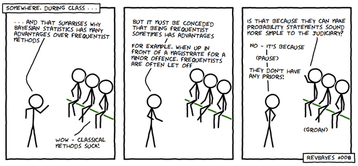

# Bayesian vs Frequentist Statistics


So far, we have been using frequentist statistics; relying on hypothesis testing and *p-values*. Frequentist statistics were particularly popular when computational resources were scarce; but this is no longer the case. It is time to reexamine the benefits of applying Bayesian statistics to software engineering empirical work. If you've been lucky enough to never have been caught in the crossfire between a Bayesian and a Frequentist, then hopefully this lesson will go smoothly for you. But if you've firmly planted your flag on either side of the "debate", take a deep breath. This lesson merely demonstrates some of the benefits of using a Bayesian approach, while also pointing out that sometimes both approaches tend to result in functionally the same courses of action. Hopefully by the end, you'll feel much more prepared to chime in if a raging Frequentist and an exasperated Bayesian walk into a bar.

~

[*Bayesian Statistics in Software Engineering: Practical Guide and Case Studies*](https://arxiv.org/pdf/1608.06865.pdf)

[*Researcher-Centered Design of Statistics: Why Bayesian Statistics Better Fit the Culture and Incentives of HCI*](https://mucollective.northwestern.edu/files/2016-BayesIncentivesHCI-CHI.pdf)

## Frequentist Statistics

Let's try to concisely summarize what we have been doing so far, as we obtain *p-values* and make conclusions about *hypotheses*. Using frequentist methods, we have been comparing groups in our data to determine the probability that those groups were drawn from the same underlying data-driven process. In basic terms, we have been figuring out if the groups are truly different or not. Because we live in a messy world, even samples from the exact same source will differ a little bit. Imagine taking a sample of algae from a pond, or collecting everyone's feelings on a random Monday. If you were to do the same sample again, under the same circumstances, you'd still get slightly different results. The point of hypothesis testing is to make claims *in general* about the samples. A small p-value (less than .05) indicates that there is a low probability that the two groups are actually the same, whereas a larger p-value indicates a higher probability that the two groups are actually the same (no difference). We have seen this in several of our lessons so far, and you will come across these methods in most empirical software engineering papers.

## Bayesian Statistics

## Original Study
they use a U test


```r
library(tidyverse)
data <- read.csv("data/agile/survey.csv")
head(data)
```

```
##         type group outcome stakeholders       time
## 1 Structured     0       9            9 Not at all
## 2      Agile     0       9            9   A little
## 3      Agile     0       7            8 Not at all
## 4      Agile     0      10           10 Not at all
## 5 Structured     0      10           10   A little
## 6 Structured     0       7            8   A little
```

```r
plt <- ggplot(data[data$type=="Structured",],aes(outcome)) + 
  geom_histogram(aes(y = ..density..), bins=25,color="black")+
  geom_density(aes(y = ..density..),color="black",fill="black", alpha=.2,stat = 'density')+
  theme_bw()
  
plt
```

<!-- --> 

```r
shapiro.test(data$outcome[data$type=="Structured"])
```

```
## 
## 	Shapiro-Wilk normality test
## 
## data:  data$outcome[data$type == "Structured"]
## W = 0.86996, p-value = 0.01777
```

```r
plt <- ggplot(data[data$type=="Agile",],aes(outcome)) + 
  geom_histogram(aes(y = ..density..), bins=25,color="black")+
  geom_density(aes(y = ..density..),color="black",fill="black", alpha=.2,stat = 'density')+
  theme_bw()
  
plt
```

<!-- --> 

```r
shapiro.test(data$outcome[data$type=="Agile"])
```

```
## 
## 	Shapiro-Wilk normality test
## 
## data:  data$outcome[data$type == "Agile"]
## W = 0.86798, p-value = 0.001824
```

```r
#HERE IS THE U TEST THEY DID
wilcox.test(data$outcome[data$type=="Agile"],data$outcome[data$type=="Structured"])
```

```
## Warning in wilcox.test.default(data$outcome[data$type == "Agile"],
## data$outcome[data$type == : cannot compute exact p-value with ties
```

```
## 
## 	Wilcoxon rank sum test with continuity correction
## 
## data:  data$outcome[data$type == "Agile"] and data$outcome[data$type == "Structured"]
## W = 236, p-value = 0.5792
## alternative hypothesis: true location shift is not equal to 0
```

```r
# larger scale study they ran, we will do the bayesian analysis here
itp <- read.csv("data/agile/itproj.csv")
head(itp)
```

```
##   type group percent    success  challenge    failure           time
## 1    H     0   1-10%       None     81-90%     11-20%        Neutral
## 2    H     0   1-10% Don't Know Don't Know Don't Know Not Applicable
## 3    H     0  31-40%     11-20%     81-90%       None    Ineffective
## 4    H     0  81-90%     71-80%     71-80%     21-30% Not Applicable
## 5    H     0  61-70% Don't Know Don't Know Don't Know        Neutral
## 6    H     0   1-10%      1-10%     81-90%      1-10%      Effective
##              ROI   stakeholders          quality
## 1        Neutral        Neutral        Effective
## 2 Not Applicable Not Applicable   Not Applicable
## 3        Neutral        Neutral Very Ineffective
## 4 Not Applicable Not Applicable   Not Applicable
## 5        Neutral Very Effective   Very Effective
## 6        Neutral    Ineffective Very Ineffective
```
## Mathematical Peacocking, stop it!


While we work through this paper, it is important to remember that the entire point of academic research is scientific findings and communication; if the paper is riddled with equations and uninterpretable variable names, then *it is bad communication*. It has absolutely nothing to do with the reader's intelligence or ability to grasp that material. It is the author's responsibility to carefully communicate problems, methods, and results, while remembering that the purpose of the work is to be distributed. As we approach the problem of **Agile vs. Structured Development**, I will continuously translate the infuriating mathematical peacocking that is meant to obscure actual communication and build up an inflated ego of an entire research field who use LaTeX expressions to make the reader feel inferior.


```r
itp <- read.csv("data/agile/itproj.csv")
head(itp)
```

```
##   type group percent    success  challenge    failure           time
## 1    H     0   1-10%       None     81-90%     11-20%        Neutral
## 2    H     0   1-10% Don't Know Don't Know Don't Know Not Applicable
## 3    H     0  31-40%     11-20%     81-90%       None    Ineffective
## 4    H     0  81-90%     71-80%     71-80%     21-30% Not Applicable
## 5    H     0  61-70% Don't Know Don't Know Don't Know        Neutral
## 6    H     0   1-10%      1-10%     81-90%      1-10%      Effective
##              ROI   stakeholders          quality
## 1        Neutral        Neutral        Effective
## 2 Not Applicable Not Applicable   Not Applicable
## 3        Neutral        Neutral Very Ineffective
## 4 Not Applicable Not Applicable   Not Applicable
## 5        Neutral Very Effective   Very Effective
## 6        Neutral    Ineffective Very Ineffective
```

```r
levels <- levels(itp$success)
replace <- c("",1,11,21,31,41,51,61,71,81,91,NA,NA)

for( i in 1:length(replace)){
  itp <- data.frame(lapply(itp, function(x) {
                  gsub(levels[i], replace[i], x)
              }))
}

itp$success <- as.numeric(as.character(itp$success))
itp$failure <- as.numeric(as.character(itp$failure))
itp$challenge <- as.numeric(as.character(itp$challenge))
summary <-data.frame()

for (i in levels(itp$type)){
  print(i)
  summary <-itp[itp$type==i,] %>%
  summarize(type=i,mean_fail = mean(na.omit(failure)),mean_chal = mean(na.omit(challenge)), mean_suc = mean(na.omit(success))) %>%
 bind_rows(.,summary)
}
```

```
## [1] "A"
## [1] "H"
## [1] "I"
## [1] "L"
## [1] "T"
```

```r
wilcox.test(itp$success[itp$type=="A"],itp$success[itp$type=="T"])
```

```
## 
## 	Wilcoxon rank sum test with continuity correction
## 
## data:  itp$success[itp$type == "A"] and itp$success[itp$type == "T"]
## W = 1908.5, p-value = 0.001021
## alternative hypothesis: true location shift is not equal to 0
```

```r
wilcox.test(itp$failure[itp$type=="A"],itp$failure[itp$type=="T"])
```

```
## Warning in wilcox.test.default(itp$failure[itp$type == "A"],
## itp$failure[itp$type == : cannot compute exact p-value with ties
```

```
## 
## 	Wilcoxon rank sum test with continuity correction
## 
## data:  itp$failure[itp$type == "A"] and itp$failure[itp$type == "T"]
## W = 345, p-value = 0.01843
## alternative hypothesis: true location shift is not equal to 0
```

```r
wilcox.test(itp$challenge[itp$type=="A"],itp$challenge[itp$type=="T"])
```

```
## 
## 	Wilcoxon rank sum test with continuity correction
## 
## data:  itp$challenge[itp$type == "A"] and itp$challenge[itp$type == "T"]
## W = 1196, p-value = 0.7509
## alternative hypothesis: true location shift is not equal to 0
```


[analyzing-software-data]: https://www.worldcat.org/title/art-and-science-of-analyzing-software-data-analysis-patterns/oclc/1062303882
[analyze-this-paper]: https://www.microsoft.com/en-us/research/publication/analyze-this-145-questions-for-data-scientists-in-software-engineering/
[coop-software-dev]: http://faculty.washington.edu/ajko/books/cooperative-software-development/index.html
[eseur]: http://www.knosof.co.uk/ESEUR/
[making-software]: https://www.worldcat.org/title/making-software-what-really-works-and-why-we-believe-it/oclc/700636023
[perspectives-ds-se]: https://www.worldcat.org/title/perspectives-on-data-science-for-software-engineering/oclc/1023264016
[sharing-data-models]: https://www.worldcat.org/title/sharing-data-and-models-in-software-engineering/oclc/906700665
