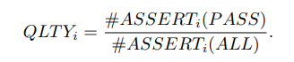
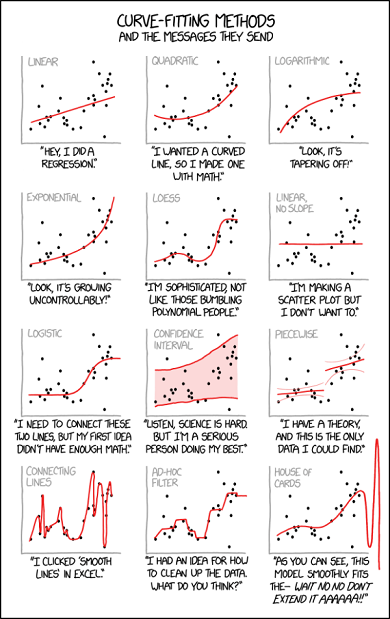

# Does It Really Matter to Test First or Test After?


In my experience, the world of software is an *opinionated* one. It seems like everyone has special tools, techniques, practices, and packages that they swear by. In this lesson, we will investigate one of these classic claims: Which is better? Test-first or test-last development? We will also explore what it looks like when people misattribute benefits to a specific practice, when in reality the cause is entirely different.
The study we are using is: [*A Dissection of the Test-Driven Development Process: Does It Really Matter to Test-First or to Test-Last?*](https://arxiv.org/pdf/1611.05994.pdf)[@Fucc2016]
Below is an excellent quote from the paper, highlighting how statistics can separate the relevant findings from other distracting factors:

> This information can liberate developers and organizations
> who are interested in adopting TDD, and trainers who
> teach it, from process dogma based on pure intuition,
> allowing them to focus on aspects that matter most in
> terms of bottom line.


## Test-Driven Development Process

- what is it?
- why do people care?

## The Study

- beyond their very complex design
- granularity, uniformity, sequencing, and refactoring
- test-first, test-last

## Modeling Recipe

> Here is a little recipe for [**modeling**](glossary.html#model):

1. Define the [**outcome variable(s)**](glossary.html#dependentvariable) that you care about

2. Define the [**factors**](glossary.html#factor) that might affect (1); be willing to iterate!

3. Determine which kind of model can explain the data we see: [`lm`,`glm`,`chisq`,`anova`](glossary.html#modeltypes) etc. 

4. Keep it as simple as possible, and try to include as few [**features**](glossary.html#factor) and [**interactions**](glossary.html#interaction) as you can. *simpler is better, without [**underfitting**](glossary.html#underfit)*

5. Determine an appropriate metric to [**evaluate the model**](glossary.html#rmse): `rmse`, `R^2`, `AIC`, `BIC`, etc.

6. Compare models to find the model with a nice balance between simplicity and [**goodness of fit**](glossary.html#goodnessoffit).

7. Continue to ask yourself; does this model actually make sense in the world? Even if it mathematically [**fits**](glossary.html#modelfit) really well, is it plausible?

8. If so, then you have a very reasonable model! If you can, test it on new data, or perform an experiment that confirms your [**hypothesis**](glossary.html#hypothesistesting).

9. Without experimentation, you cannot know anything about [**causality**](glossary.html#causality). Instead, your model provides a representation of the phenomenon and the factors involved.


## Outcomes We Care About

> *Which subset of the factors best explain
the variability in external quality?*

So basically this question is asking "what combo of variables contributes to making stuff good?"

With any measure, we have to [**operationalize**](glossary.html#operationalize) it in some way. "Code Quality" is defined as: 
, with *QLTYi* defined as: 

Don't panic. I've actually wanted to do a research study where I use eyetracking technology to watch how learners react to equations in an academic paper. If you're anything like me, your eyes *glaze right over it* and then you curse yourself for not immediately understanding it by just absorbing it into your mind without reading it. When you dig into these equations, you see that it's a fancy way of counting stuff. `TUS` is the number of "Tackled User Stories", or "how many problems attempted". So, for each of those stories, count up the proportion of passing assert statements, and take the average over all the stories attempted. This way, we are simply measuring functional correctedness, with no accounting for things like style or readability.


> *Which subset of the factors best explain
the variability in developer productivity?*

And this question is asking "what combo of variables contributes to developers producing more?" (though you may remember from [Analyze This!](../analyze_this/index.html) that this may be unwise to measure!)

Productivity is defined as:  with OUTPUT as the total passing assert statements. TIME measures from the time the task is opened until closed.


## Factors We Measure

The following is taken directly from Table 2.
 
- **Granularity**: A fine-grained development process is characterized by a cycle duration typically between 5 and 10 minutes. A small value indicates a granular process. A large value indicates a coarse process.

- **Uniformity**: A uniform development process is characterized by cycles having approximately the same duration. A value close to zero indicates a uniform process. A large value indicates a heterogeneous, or unsteady, process.

- **Sequencing**: Indicates the prevalence of test-first sequencing during the development process. A value close to 100 indicates the use of a predominantly test-first dynamic. A value close to zero indicates a persistent violation of thre test-first dynamic.

- **Refactoring**: Indicates the prevalence of the 
refactoring activity in the development process. A value close to zero indicates nearly no detectable refactoring activity (negligable refactoring effort). A value close to 100 indicates a process dominated by refactoring activity (high refactoring effort).


```r
data <- read.csv("data/dissectionTDD/dataset.csv",sep=";")
head(data)
```

```
##   ID  QLTY PROD   GRA  UNI   SEQ   REF
## 1  1 77.27 0.07  0.87 0.29  0.00 45.45
## 2  2 58.71 0.21 31.07 3.26 50.00 50.00
## 3  3 85.42 0.32  1.66 1.78 28.12  6.25
## 4  4 84.52 0.34  1.05 0.91  8.62 50.00
## 5  5 45.91 0.17  7.30 6.40 20.00 26.66
## 6  6 77.95 0.37  8.02 8.36  0.00 44.44
```

## Descriptive Statistics
There is a difference between [**descriptive statistics**](glossary.html#descriptivestatistics) and [**inferential statistics**](glossary.html#inferentialstatistics). Descriptive statistics describe properties of the data; such as [**means**](glossary.html#mean), [**ranges**](glossary.html#range), and [**normality**](glossary.html#normaldistribution) of the variables of interest. Inferential statistics will draw the actual *conclusions* about the data; reporting on [**correlations**](glossary.html#correlation), [**hypothesis tests**](glossary.html#hypothesistesting), and [**estimation of parameters]**](glossary.html#parameter). Inferential statistics helps to generalize about a larger [**population**](glossary.html#population), that can go beyond the descriptive statistics of an immediate [**sample**](glossary.html#sample).


```r
library(ggplot2)

#small function to generate colors for ggplot
gg_color_hue <- function(n) {
  hues = seq(15, 375, length = n + 1)
  hcl(h = hues, l = 65, c = 100)[1:n]
}

titles <- c("Quality","Productivity","Granularity","Uniformity","Sequencing","Refactoring")
#get some colors for each
cols = gg_color_hue(length(titles))

# loop to create 6 density plots to look at spread for each variable
loop <- 2:7
for( i in loop){
  x <- data[[i]]
  plt <- ggplot(data,aes(x)) + 
    ggtitle(paste("Histogram and Density for",titles[i-1]))+
  geom_histogram(aes(y = ..density..), bins=25,color="black",fill=cols[i-1])+
  geom_density(aes(y = ..density..),color="black",fill="black", alpha=.2,stat = 'density')+
    xlab(titles[i-1])+
  theme_bw()
  
  print(plt)
  print(shapiro.test(x))
}
```

<!-- --> 

```
## 
## 	Shapiro-Wilk normality test
## 
## data:  x
## W = 0.97198, p-value = 0.0695
```

<!-- --> 

```
## 
## 	Shapiro-Wilk normality test
## 
## data:  x
## W = 0.80645, p-value = 5.326e-09
```

<!-- --> 

```
## 
## 	Shapiro-Wilk normality test
## 
## data:  x
## W = 0.54482, p-value = 1.524e-14
```

<!-- --> 

```
## 
## 	Shapiro-Wilk normality test
## 
## data:  x
## W = 0.67565, p-value = 3.623e-12
```

<!-- --> 

```
## 
## 	Shapiro-Wilk normality test
## 
## data:  x
## W = 0.96182, p-value = 0.01545
```

<!-- --> 

```
## 
## 	Shapiro-Wilk normality test
## 
## data:  x
## W = 0.94084, p-value = 0.0009059
```

## Let's Talk About Models
Remember that we are looking for *which features affect quality and productivity*. Like many model setups, we have collected data and are looking for which features carry the most [**weight**](glossary.html#weight). That means, there are a bunch of factors affecting an outcome (like Productivity) and we want to know which ones matter the most. You might also simply be looking to record the weights on each of the features, not caring which ones "matter" but just trying to get an accurate representation of the phenomenon (say, what is affecting climate change, or what factors lead to higher rates of cancer?) When creating a model, we are looking to represent the various dynamics in the world that make something happen; *we represent it so that we can understand it and predict it*. In our scenario, we have quantitative [**measures**](glossary.html#measure) for the following: **Granularity, Uniformity, Sequencing, Refactoring, Quality**, and **Productivity**. We want to know how `GRA`, `UNI`, `SEQ`, and `REF` are affecting our outcome variables: `PRO` and `QLTY`. Ideally, our objective would be to provide a conclusion like *"The more refactoring you do, the better your code quality, and test-first is better for productivity"* (not an actual conclusion of this paper). This paper keeps a certain tone throughout, emphasizing how we can use actual metrics to stop petty debates within the software world.

If you jump ahead to the **Discussion**, we know that the eventual findings are:

> We conclude that granularity, uniformity and refactoring effort together constitute
the best explanatory factors for external quality [and] productivity.

So what would that conclusion look like in model form? First off, the conclusion implies that `SEQ` does not matter, and is not even included in the best performing model. This is interesting, because so many people evangelize the Test-Driven Development technique! In fact, it's not the sequencing of when you write the tests, but the level to which you iterate rapidly when writing code that affects quality and productivity. It could be the case that people attributed their success to the wrong factor: *test-first* or *test-last*, when in fact, iteration was key to success. 


## Regression Analysis vs. Hypothesis Testing
- explain how because theyre all continuous variables, we dont do hypothesis testing. we use regression
TODO


```r
m <- glm(QLTY ~ GRA + UNI + REF + SEQ +GRA:UNI+SEQ:REF, data=data)
m
```

```
## 
## Call:  glm(formula = QLTY ~ GRA + UNI + REF + SEQ + GRA:UNI + SEQ:REF, 
##     data = data)
## 
## Coefficients:
## (Intercept)          GRA          UNI          REF          SEQ  
##   78.880246    -0.380340    -0.605808    -0.298070     0.012607  
##     GRA:UNI      REF:SEQ  
##    0.005605     0.001325  
## 
## Degrees of Freedom: 81 Total (i.e. Null);  75 Residual
## Null Deviance:	    30130 
## Residual Deviance: 24850 	AIC: 717.2
```

```r
summary(m)
```

```
## 
## Call:
## glm(formula = QLTY ~ GRA + UNI + REF + SEQ + GRA:UNI + SEQ:REF, 
##     data = data)
## 
## Deviance Residuals: 
##     Min       1Q   Median       3Q      Max  
## -60.146  -12.889    0.459   12.631   32.976  
## 
## Coefficients:
##              Estimate Std. Error t value Pr(>|t|)    
## (Intercept) 78.880246   7.132852  11.059   <2e-16 ***
## GRA         -0.380340   0.193825  -1.962   0.0534 .  
## UNI         -0.605808   0.489124  -1.239   0.2194    
## REF         -0.298070   0.190446  -1.565   0.1218    
## SEQ          0.012607   0.137549   0.092   0.9272    
## GRA:UNI      0.005605   0.013912   0.403   0.6882    
## REF:SEQ      0.001325   0.005571   0.238   0.8126    
## ---
## Signif. codes:  0 '***' 0.001 '**' 0.01 '*' 0.05 '.' 0.1 ' ' 1
## 
## (Dispersion parameter for gaussian family taken to be 331.2695)
## 
##     Null deviance: 30129  on 81  degrees of freedom
## Residual deviance: 24845  on 75  degrees of freedom
## AIC: 717.23
## 
## Number of Fisher Scoring iterations: 2
```

```r
AIC(m)
```

```
## [1] 717.2294
```

```r
summary(lm(QLTY ~ GRA + UNI + REF + SEQ +GRA:UNI+SEQ:REF, data=data))$r.squared
```

```
## [1] 0.1753826
```

```r
m <- glm(QLTY ~ GRA + UNI +REF, data=data)
#m
#summary(m)
AIC(m)
```

```
## [1] 711.5502
```

```r
summary(lm(QLTY ~ GRA + UNI + REF + SEQ, data=data))$r.squared
```

```
## [1] 0.1731051
```

## Let's Talk About Interactions
This paper mentions something called [**interactions**](glossary.html#interaction). We will walk through a more basic example of what an interaction is before exploring what it means in this context. You can imagine a scenario where there is a [**categorical variable**](glossary.html#factor): `test_first`, which can take on either 1 or 0 if the developer tested first or last, respectively. Now imagine we also record whether developers are coding in the morning or the afternoon. *It just so happens in our fake scenario*, that if you test-first in the mornings, your quality skyrockets. If you test-first any other time, you don't get the same effect. Therefore, there is an interaction between testing first and the time of day. This is **problematic** because if we don't look into this interaction, we simply report a mean quality of somewhere in the middle; not accounting for how  the test sequencing and time of day is affecting that quality. **If there is an interaction, the lines in the categorical interaction plot will cross**.


```r
fake <- read.csv("data/fake_interaction.csv")
head(fake,10)
```

```
##    ID test_first QLTY morning
## 1   1          0    9       1
## 2   2          0    8       1
## 3   3          0    4       1
## 4   4          0   97       0
## 5   5          0   91       0
## 6   6          1    0       0
## 7   7          1    4       0
## 8   8          1    9       0
## 9   9          1   93       1
## 10 10          1   98       1
```

```r
fake$morning <- as.factor(fake$morning)
fake$test_first <- as.factor(fake$test_first)
interaction.plot(factor(fake$test_first),factor(fake$morning),fake$QLTY)
```

<!-- --> 

Take a look at the means when we *do* take into account the interaction, looking at both `test_first` and `morning` as contributing to `QLTY`. If we *only* look at one or the other, our means are misleading, because clearly there is another factor affecting the code quality! Sure, we could say that on average the code quality is somewhere in the middle; but it's disingenuous because the truth is that your code quality will suffer if you're using test_first in the afternoon. (In this **FAKE DATA**, of course). In order to truly represent the phenomenon, we have to include results about the interaction.


```r
fake %>%
  group_by(test_first,morning) %>%
  summarise(mean=mean(QLTY))
```

```
## # A tibble: 4 x 3
## # Groups:   test_first [2]
##   test_first morning  mean
##   <fct>      <fct>   <dbl>
## 1 0          0       94   
## 2 0          1        7   
## 3 1          0        4.33
## 4 1          1       95.5
```

```r
fake %>%
  group_by(test_first) %>%
  summarise(mean=mean(QLTY))
```

```
## # A tibble: 2 x 2
##   test_first  mean
##   <fct>      <dbl>
## 1 0           41.8
## 2 1           40.8
```

```r
fake %>%
  group_by(morning) %>%
  summarise(mean=mean(QLTY))
```

```
## # A tibble: 2 x 2
##   morning  mean
##   <fct>   <dbl>
## 1 0        40.2
## 2 1        42.4
```

## Component + Residual Plots

```r
library(car)

m<-glm(QLTY~GRA+UNI+REF,data=data)
crPlots(m)
```

<!-- --> 

<center></center><br>

## Interpreting Regression Output
Here I've used a [**general linear model**](glossary.html#modeltypes) to map out the factors affecting code quality. In the paper, they systematically included or excluded different factors and their interactions, in order to find the best fitting model. "Finding the best fitting model" means finding which combination of factors, and in what weights, best represents the relationship between those factors and the outcome we care about (quality or productivity). Remember, you could always add more and more factors to a model; the code will still output an answer. But it doesn't mean it's a *correct* model, or a *useful* one.

Looking at the final model used in the paper, we see that the factors kept were **Granularity, Uniformity, and Refactoring** in order to model **Code Quality**. This is particuarly interesting because **Sequencing** is *not* a factor in the model. The big question from software engineers was about *test-first* vs. *test-last*, but it turns out that it really doesn't matter. The other factors are more important, and have a *negative relationship* with code quality. That negative relationship is because of how the measures were formulated; the closer to 0, the more granular and uniform the cycles were. So, the smaller the values for `GRA`, `UNI` and `REF`, the higher the value on `QLTY`. By looking at the output of the summary of the model, we see the Estimates as negative, and significant (or at least marginally significant). You can see significance by noting the number of stars (***) by each factor. (.) indicates a marginal trend. The t value is also indicative of how large the effect is, with the absolute value of t indicating significance. All of those significance factors are basically saying "hey! these factors are contributing to this outcome in a meaningful way!"


```r
summary(m)
```

```
## 
## Call:
## glm(formula = QLTY ~ GRA + UNI + REF, data = data)
## 
## Deviance Residuals: 
##     Min       1Q   Median       3Q      Max  
## -60.710  -13.641    0.358   11.733   32.454  
## 
## Coefficients:
##             Estimate Std. Error t value Pr(>|t|)    
## (Intercept)  78.9278     4.0694  19.395   <2e-16 ***
## GRA          -0.3576     0.1690  -2.115   0.0376 *  
## UNI          -0.4391     0.2502  -1.754   0.0833 .  
## REF          -0.2799     0.1159  -2.416   0.0180 *  
## ---
## Signif. codes:  0 '***' 0.001 '**' 0.01 '*' 0.05 '.' 0.1 ' ' 1
## 
## (Dispersion parameter for gaussian family taken to be 319.7768)
## 
##     Null deviance: 30129  on 81  degrees of freedom
## Residual deviance: 24943  on 78  degrees of freedom
## AIC: 711.55
## 
## Number of Fisher Scoring iterations: 2
```

## Evaluating How Good a Model Is (AIC)
How do we determine which model is the "right" one? Well, there's a few ways to do that. Sometimes, we simply look at how good the model is at predicting test data. In this case, we are using something called AIC (Akaike Information Criterion). This is a very specific way of evaluating a model that deals with *preserving information*. It's interesting and cool, and strikes a nice balance between [**goodness of fit**](glossary.html#goodnessoffit) and *simplicity* (not throwing too many parameters into the model). It's okay if that doesn't make sense; just know that a lower AIC indicates a "better" model. Notice how if we include `SEQ` in the model, the AIC is higher.


```r
print(AIC(m))
```

```
## [1] 711.5502
```

```r
new_m <- glm(QLTY~GRA+UNI+REF+SEQ,data=data)
print(AIC(new_m))
```

```
## [1] 713.4556
```

<center></center><br>

### You could try any combination of factors and their interactions, until you achieved the best fitting model for the phenomenon. Davide Fucci carefully walks through model choice, feature selection, investigation of interactions, and more. Follow the paper step by step to replicate their results on this data!


[analyzing-software-data]: https://www.worldcat.org/title/art-and-science-of-analyzing-software-data-analysis-patterns/oclc/1062303882
[analyze-this-paper]: https://www.microsoft.com/en-us/research/publication/analyze-this-145-questions-for-data-scientists-in-software-engineering/
[coop-software-dev]: http://faculty.washington.edu/ajko/books/cooperative-software-development/index.html
[eseur]: http://www.knosof.co.uk/ESEUR/
[making-software]: https://www.worldcat.org/title/making-software-what-really-works-and-why-we-believe-it/oclc/700636023
[perspectives-ds-se]: https://www.worldcat.org/title/perspectives-on-data-science-for-software-engineering/oclc/1023264016
[sharing-data-models]: https://www.worldcat.org/title/sharing-data-and-models-in-software-engineering/oclc/906700665
