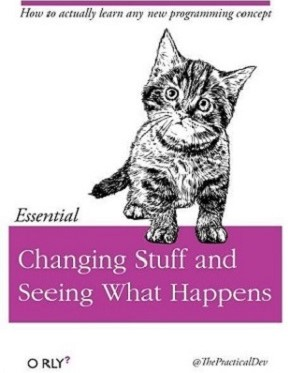
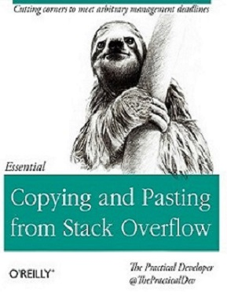

```{r setup, include=FALSE}
knitr::opts_chunk$set(echo = TRUE)
library(kableExtra)
library(ggplot2)
library(dplyr)
```

## I am thankful for Stack Overflow

You've come through for me in my dark moments of swearing at Tetris, forgetting any and all JavaScript syntax, and more. I dedicate this lesson to all the Stack Overflow contributors who didn't make me feel like a moron, and to all the new students fixing their bugs one at a time with 26 tabs open.





Fake book covers from *the Practical Developer*, mimicking O'Reilly textbooks

## Stack Exchange Queries

One of the coolest things about learning Data Science and statistics is that we can apply our methods to any dataset that interests us. This is an excellent opportunity for creativity and expression. But it can be difficult to know where to begin; especially because our questions might be too advanced, or difficult to get data for. These lessons approach this problem by analyzing data from Software Engineering research, and guiding the learner through the findings. We also use sources like Stack Overflow, GitHub, and Eclipse (Java IDE) Bug Reports.

```{r}
data <- read.csv("../data/stackoverflow/top10tags.csv")

kable(head(data,13))%>%
  kable_styling(bootstrap_options = c("striped", "hover"))


# total growth over time, holding on to the cumulative sum
cumulative <- data %>%
  group_by(TagName) %>%
  mutate(csum=cumsum(X)) %>%
  arrange(Month)

#summarizing up the totals, collapsing over Month
summary <- data %>%
  group_by(TagName) %>%
  summarise(sum=sum(X))%>%
  arrange(desc(sum))

ggplot(summary,aes(TagName,sum,fill=TagName))+
  geom_bar(stat="identity")+
  ggtitle("Total Questions With Top 10 Stack Overflow Tags")+
  theme_bw()

kable(summary)%>%
  kable_styling(bootstrap_options = c("striped", "hover"))
```


```{r, fig.width=10}


plt = ggplot(data,aes(Month,X,group=TagName,color=TagName))+
  geom_line(size=1)+
  ggtitle("Top 10 Stack Overflow Tags Over Time")+
  theme_bw()+
  theme(axis.text.x=element_blank())
plt


plt = ggplot(cumulative,aes(Month,csum,group=TagName,color=TagName))+
  geom_line(size=1)+
  ggtitle("Top 10 Stack Overflow Tags Over Time (Cumulative)")+
  theme_bw()+
  theme(axis.text.x=element_blank())
plt

```
