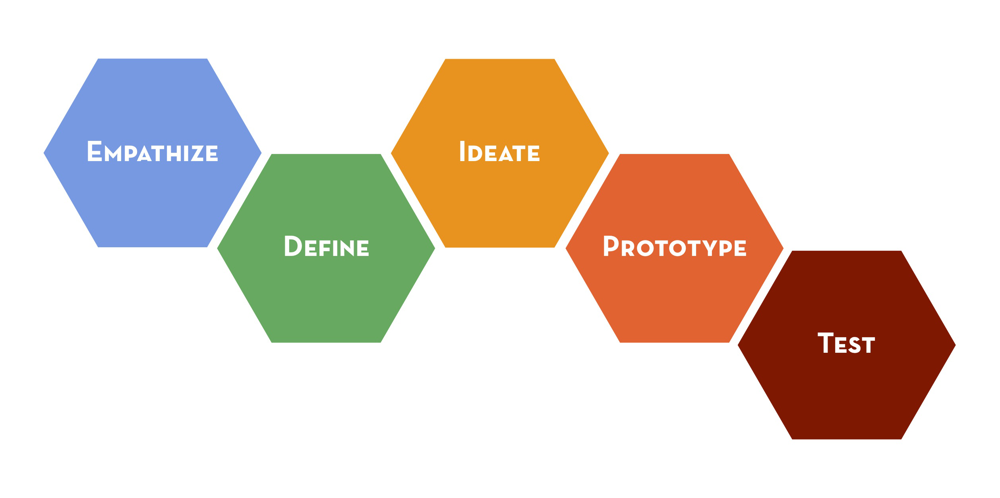

```{r setup, include=FALSE}
knitr::opts_chunk$set(echo = TRUE)
```


In my experience, the world of software is an *opinionated* one. It seems like everyone has special tools, techniques, practices, and packages that they swear by. In this lesson, we will investigate one of these classic claims: Which is better? Test-first or test-last development? We will also explore what it looks like when people misattribute benefits to a specific practice, when in reality the cause is entirely different. The study we are using is: [*A Dissection of the Test-Driven Development
Process: Does It Really Matter to Test-First or to
Test-Last?*](https://arxiv.org/pdf/1611.05994.pdf)
Below is an excellent quote from the paper, highlighting how statistics can separate the relevant findings from other distracting factors:

> *"This information can liberate developers and organizations
who are interested in adopting TDD, and trainers who
teach it, from process dogma based on pure intuition,
allowing them to focus on aspects that matter most in
terms of bottom line."*




## Test-Driven Development Process
- what is it?
- why do people care?

## The Study
- beyond their very complex design
- granularity, uniformity, sequencing, and refactoring
- test-first, test-last


```{r}
data <- read.csv("../bin/data/dissectionTDD/dataset.csv",sep=";")
head(data)
```

## Outcomes We Care About

> *Which subset of the factors best explain
the variability in external quality?*

With any measure, we have to operationalize it in some way. "Code Quality" is defined as: 
, with *QLTYi* defined as: 

Don't panic. I've actually wanted to do a research study where I use eyetracking technology to watch how learners react to equations in an academic paper. If you're anything like me, your eyes *glaze right over it* and then you curse yourself for not immediately understanding it by just absorbing it into your mind without reading it. When you dig into these equations, you see that it's a fancy way of counting stuff. `TUS` is the number of "Tackled User Stories", or "how many problems attempted". So, for each of those stories, count up the proportion of passing assert statements, and take the average over all the stories attempted. This way, we are simply measuring functional correctedness, with no accounting for things like style or readability.


> *Which subset of the factors best explain
the variability in developer productivity?*

Productivity is defined as:  with OUTPUT as the total passing assert statements. TIME measures from the time the task is opened until closed.


## Factors We Measure

The following is taken directly from Table 2.
 
- **Granularity**: A fine-grained development process is characterized by a cycle duration typically between 5 and 10 minutes. A small value indicates a granular process. A large value indicates a coarse process.

- **Uniformity**: A uniform development process is characterized by cycles having approximately the same duration. A value close to zero indicates a uniform process. A large value indicates a heterogeneous, or unsteady, process.

- **Sequencing**: Indicates the prevalence of test-first sequencing during the development process. A value close to 100 indicates the use of a predominantly test-first dynamic. A value close to zero indicates a persistent violation of thre test-first dynamic.

- **Refactoring**: Indicates the prevalence of the 
refactoring activity in the development process. A value close to zero indicates nearly no detectable refactoring activity (negligable refactoring effort). A value close to 100 indicates a process dominated by refactoring activity (high refactoring effort).


## Descriptive Statistics
There is a difference between **descriptive statistics** and **inferential statistics**. Descriptive statistics describe properties of the data; such as **means**, **ranges**, and **normality** of the variables of interest. Inferential statistics will draw the actual *conclusions* about the data; reporting on **correlations**, **hypothesis tests**, and **estimation of parameters**. Inferential statistics helps to generalize about a larger **population**, that can go beyond the descriptive statistics of an immediate sample.

```{r}
library(ggplot2)

#small function to generate colors for ggplot
gg_color_hue <- function(n) {
  hues = seq(15, 375, length = n + 1)
  hcl(h = hues, l = 65, c = 100)[1:n]
}

titles <- c("Quality","Productivity","Granularity","Uniformity","Sequencing","Refactoring")
#get some colors for each
cols = gg_color_hue(length(titles))

# loop to create 6 density plots to look at spread for each variable
loop <- 2:7
for( i in loop){
  x <- data[[i]]
  plt <- ggplot(data,aes(x)) + 
    ggtitle(paste("Histogram and Density for",titles[i-1]))+
  geom_histogram(aes(y = ..density..), bins=25,color="black",fill=cols[i-1])+
  geom_density(aes(y = ..density..),color="black",fill="black", alpha=.2,stat = 'density')+
    xlab(titles[i-1])+
  theme_bw()
  
  print(plt)
  print(shapiro.test(x))
}
```

## Let's Talk About Models
Remember that we are looking for *which features affect quality and productivity*. Like many model setups, we have collected data and are looking for which features carry the most **weight**. That means, there are a bunch of factors affecting an outcome (like Productivity) and we want to know which ones matter the most. You might also simply be looking to record the weights on each of the features, not caring which ones "matter" but just trying to get an accurate representation of the phenomenon (say, what is affecting climate change, or what factors lead to higher rates of cancer?) When creating a model, we are looking to represent the various dynamics in the world that make something happen; *we represent it so that we can understand it and predict it*. In our scenario, we have quantitative measures for the following: **Granularity, Uniformity, Sequencing, Refactoring, Quality**, and **Productivity**. We want to know how `GRA`, `UNI`, `SEQ`, and `REF` are affecting our outcome variables: `PRO` and `QLTY`. Ideally, our objective would be to provide a conclusion like *"The more refactoring you do, the better your code quality, and test-first is better for productivity"* (not an actual conclusion of this paper). This paper keeps a certain tone throughout, emphasizing how we can use actual metrics to stop petty debates within the software world.

If you jump ahead to the **Discussion**, we know that the eventual findings are:

> We conclude that granularity, uniformity and refactoring effort together constitute
the best explanatory factors for external quality [and] productivity.

So what would that conclusion look like in model form? First off, the conclusion implies that `SEQ` does not matter, and is not even included in the best performing model. This is interesting, because so many people evangelize the Test-Driven Development technique! In fact, it's not the sequencing of when you write the tests, but the level to which you iterate rapidly when writing code that affects quality and productivity.

## AIC
- complexity of models
- simpler is better
- information loss
- we always need some way to evaluate a model

*remember our recipe* -> outcome variable ~ factors, explain the data we see, as simply as possible. compare models to find simplest/best fit. That's our winner


```{r}

m <- glm(QLTY ~ GRA + UNI + REF + SEQ +GRA:UNI+SEQ:REF, data=data)
m
summary(m)
AIC(m)
summary(lm(QLTY ~ GRA + UNI + REF + SEQ +GRA:UNI+SEQ:REF, data=data))$r.squared


m <- glm(QLTY ~ GRA + UNI +REF, data=data)
#m
#summary(m)
AIC(m)
summary(lm(QLTY ~ GRA + UNI + REF + SEQ, data=data))$r.squared

```

## Let's Talk About Interactions
This paper mentions something called **interactions**. We will walk through a more basic example of what an interaction is before exploring what it means in this context. You can imagine a scenario where 

```{r}
cor(data$REF,data$SEQ)
## Component Residual Plots

```

## Interpreting Regression Output


## Component + Residual Plots
```{r fig.height=6.5, fig.width=9.5}
library(car)

m<-glm(QLTY~GRA+UNI+REF,data=data)
crPlots(m)

```

## Regression Analysis vs. Hypothesis Testing
- explain how because theyre all continuous variables, we dont do hypothesis testing. we use regression